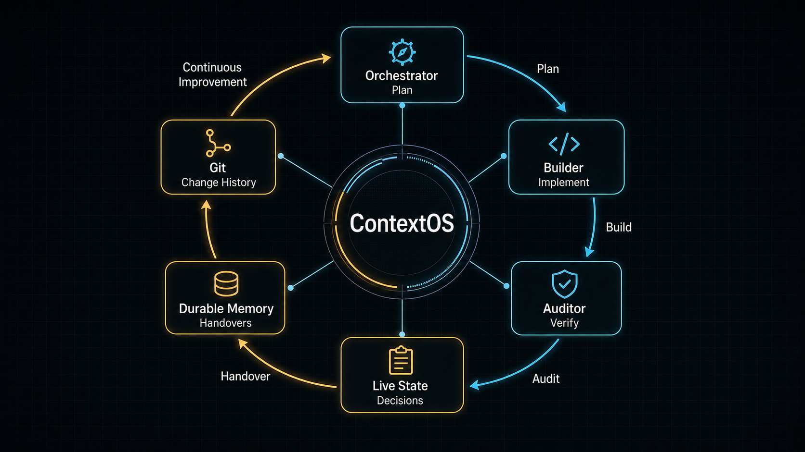
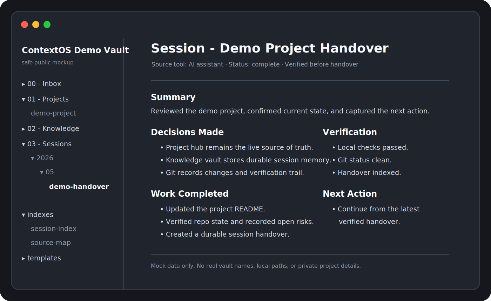

# ContextOS

<p align="center">
  <strong>The AI librarian skill with clear oversight for handovers, source-of-truth discipline, memory hygiene and cross-tool continuity</strong><br><br>
  Built for persistent, tool-agnostic AI workflows that need to survive across models, sessions, notes, repos, project hubs, memory tools, and whatever comes next.
</p>

<p align="center">
  
</p>

<p align="center">
  <a href="#the-problem">The Problem</a> ·
  <a href="#the-model">The Model</a> ·
  <a href="#built-to-move-with-your-tools">Future-Proof</a> ·
  <a href="#built-on-existing-tools">Tools</a> ·
  <a href="#quickstart">Quickstart</a> ·
  <a href="#install-and-adapt">Install</a> ·
  <a href="#safety-model">Safety</a>
</p>

---

## Why I Built This - The Problem

I didn't start by trying to build a system.

A month prior, I was mostly using ChatGPT in a browser like most people. Then I started adding the tools that were supposed to make the work more powerful, reliable, and efficient.

- I had Claude Desktop as my orchestrator and planner
- Claude Code as my builder
- Codex as my auditor
- Notion as my operational hub
- Obsidian as my second brain
- Git for change history
- Claude-mem for long-term memory
- Graphify for mapping connections
- I had projects, skills, hooks and local workflows

Individually, the tools were excellent. But together, they drifted.

A coding session could move the repo forward, but the project hub might not know. A decision could be made in chat, but never reach the knowledge base. Git could show what changed, but not why it mattered. Memory could retrieve old context, but not tell me whether it was still current.

That was the real problem - How do I make AI work stay consistent and aligned across tools, sessions, projects, and time?

I didn't need more notes, another dashboard, or productivity ritual.

I needed an operating layer that helped every AI assistant understand what role it was playing, which source of truth to trust, what needed recording, and how to hand work over without losing the thread.

That became ContextOS.

---

## What ContextOS Does

ContextOS stops AI work from falling apart between sessions, tools, and assistants.

Think of it as the sorting office for your AI system.

It keeps Claude, Codex, coding agents, notes, repos, project hubs, memory tools, and handovers aligned around one operating model.

It's designed to be model-agnostic and tool-agnostic, so your operating model survives if or when your AI stack changes.

So every assistant knows:

- what is current
- what changed
- what matters
- where to record it
- what is off limits
- what happens next

<p align="center">
  
</p>

<p align="center">
  <em>A sanitised demo vault showing how ContextOS turns AI sessions into durable, searchable handovers.</em>
</p>

---

## The Model

ContextOS gives AI-assisted work a repeatable structure:

| Need | ContextOS Answer |
|---|---|
| What is current? | One live operational source of truth |
| What should be remembered? | Durable markdown knowledge and handovers |
| What changed? | Git history and clear commits |
| What happens next? | A single next action in every handover |
| What is off limits? | Explicit boundaries for restricted material |
| How does the system improve? | Audits and lessons feed back into the next cycle |

The core rule is simple:

> Every tool has a job. No tool is allowed to pretend it is the source of truth for everything.

In a ContextOS-style setup:

| Layer | Job |
|---|---|
| Orchestrator | Holds the plan, challenges direction, manages live state |
| Implementation agent | Changes files, runs tests, commits code |
| Auditor | Reviews local state, checks claims, challenges drift |
| Operational hub | Holds live project status, decisions, specs, and logs |
| Knowledge vault | Holds durable notes, session memory, reusable patterns |
| Git | Holds code history and diff truth |
| Encrypted storage | Holds restricted material that AI does not read by default |

The point is not to make every tool remember everything.

The point is to ensure they all have the right context and stop them remembering the wrong things.

---

## Built To Move With Your Tools

ContextOS is not tied to one model, one app, or one vendor.

It was built around Claude, Codex, Obsidian, Notion, Git, claude-mem, Graphify, and local workflows, but the operating model is portable.

If you change your stack later, the structure still holds:

- swap Claude for another orchestrator
- swap Codex for another auditor
- swap Obsidian for another markdown vault
- swap Notion for another project hub
- swap claude-mem for another memory layer
- swap Graphify for another knowledge graph
- swap GitHub for another code host

The tools can change.

The discipline stays the same.

ContextOS is designed around roles, sources of truth, handovers, boundaries, and verification. Those patterns survive tool changes, model upgrades, new MCPs, new agents, and whatever comes next.

---

## What This Repo Includes

| Path | Purpose |
|---|---|
| [`BOOTSTRAP.md`](BOOTSTRAP.md) | First-session setup prompt for starting from zero |
| [`docs/architecture.md`](docs/architecture.md) | Role map, read sequence, and handoff flow |
| [`docs/safety-model.md`](docs/safety-model.md) | Exclusion-first boundary model for restricted material |
| [`INSTALL.md`](INSTALL.md) | Practical install and adaptation guide |
| [`CHANGELOG.md`](CHANGELOG.md) | Version history |
| [`CONTRIBUTING.md`](CONTRIBUTING.md) | Contribution guidance |
| [`LICENSE`](LICENSE) | MIT license |
| [`docs/setup-notes.md`](docs/setup-notes.md) | Minimal setup notes for adapting the pattern |
| [`templates/session-handover.md`](templates/session-handover.md) | Durable handover template for AI sessions |
| [`templates/source-of-truth-map.md`](templates/source-of-truth-map.md) | Template for defining what each system owns |
| [`examples/session-handover-example.md`](examples/session-handover-example.md) | Example handover showing the expected output |
| [`skills/context-os.md`](skills/context-os.md) | Public-safe ContextOS skill pattern |

This is not a product, SaaS platform, or magic memory layer.

It is a disciplined way to make AI-assisted work survive across sessions, tools, projects, and mistakes.

---

## Built On Existing Tools

ContextOS is not trying to replace the tools that already do their jobs well.

It connects them with clearer roles.

| Tool | What It Contributes | ContextOS Role |
|---|---|---|
| Obsidian | Local markdown notes, backlinks, graph view, durable knowledge | Long-term memory and session handovers |
| Notion | Structured project pages, databases, specs, logs, and operating state | Live operational source of truth |
| Claude Desktop | Conversation, orchestration, reasoning, and project direction | Strategic operator and state manager |
| Claude Code | Local file access, coding sessions, tests, and implementation work | Builder and session producer |
| Codex | Independent repo inspection, audit, and implementation verification | External checker and accountability layer |
| Git | Commit history, diffs, branches, and rollback points | Change ledger for code and public artefacts |
| Claude-mem | Retrieved context from prior work | Context assistant, not canonical truth |
| Graphify | Knowledge graph extraction and navigation | Discovery layer, not source of truth |

The value is not that ContextOS owns these tools.

The value is that it gives them a shared operating model.

---

## References & Acknowledgements

ContextOS stands on the work of people and teams already building excellent tools.

Useful starting points:

- [Obsidian](https://obsidian.md/) - local-first markdown knowledge base, backlinks, graph view, and long-term notes.
- [Obsidian Local REST API](https://github.com/coddingtonbear/obsidian-local-rest-api) - local API access for reading, writing, and searching an Obsidian vault.
- [Notion](https://www.notion.com/) - structured docs, databases, project hubs, specs, and operational state.
- [Claude](https://claude.ai/) and [Claude Code](https://code.claude.com/docs) - orchestration, implementation, reasoning, and coding workflows.
- [OpenAI Codex](https://openai.com/codex) - independent coding, review, and implementation workflows.
- [Git](https://git-scm.com/) - distributed version control and change history.
- [claude-mem](https://github.com/thedotmack/claude-mem) - persistent Claude Code memory and context retrieval.
- [Graphify](https://github.com/safishamsi/graphify) - graph-based knowledge extraction and navigation.

ContextOS is not affiliated with or endorsed by these projects.

It is an operating pattern for combining them with clearer boundaries, handovers, and source-of-truth discipline.

---

## Before And After

| Before ContextOS | After ContextOS |
|---|---|
| Every chat reconstructed the project from fragments | Each session starts from the right source of truth |
| Notes, tasks, commits, and memories drifted apart | Each layer has a clear job |
| Agents made confident claims from partial context | Conflicts are flagged instead of guessed away |
| Work ended with useful context trapped in the chat | Work ends with a durable handover |
| Memory retrieval felt helpful but sometimes stale | Memory is treated as context, not canonical truth |
| Admin overhead kept growing | The operating model improves through audits and lessons |

## Quickstart

### 60-Second Start

Copy this into your AI assistant first:

```text
I want to try ContextOS.

Audit my current AI workflow and produce:
- a source-of-truth map
- a handover location
- restricted-material boundaries
- a session-end checklist
- the first setup step

Ask only the questions you need answered. Keep it simple enough that I will actually use it.
```

Then copy these into your setup:

- [`skills/context-os.md`](skills/context-os.md)
- [`templates/session-handover.md`](templates/session-handover.md)
- [`templates/source-of-truth-map.md`](templates/source-of-truth-map.md)

The success test is simple:

```text
Another assistant should be able to read the latest handover and continue without guessing.
```

### Full Setup Prompt

If you want a more complete first pass, ask your AI assistant to audit your current workflow.

Copy and paste this:

```text
I want to set up ContextOS for my AI workflow.

Your first job is to audit my current setup and produce a simple source-of-truth map.

Ask me only the questions you need answered. Do not over-plan.

Find out:

1. Which tool owns live project state.
2. Where durable notes and handovers should live.
3. Where code changes are tracked.
4. Which AI assistants or agents I use.
5. Which files, folders, systems, or data types must never be ingested automatically.
6. What should happen at the end of a meaningful session.
7. What a clean restart should look like.

Output:

- Current tool map
- Source-of-truth map
- Handover location
- Restricted-material boundaries
- Session-end checklist
- First ContextOS setup step

Rules:

- Do not assume all tools are interchangeable.
- Do not treat memory retrieval as source of truth.
- Do not ingest or summarise private material unless I explicitly approve it.
- Keep the setup simple enough that I will actually use it.
```

Once the audit is done, copy these into your setup:

- [`skills/context-os.md`](skills/context-os.md)
- [`templates/session-handover.md`](templates/session-handover.md)
- [`templates/source-of-truth-map.md`](templates/source-of-truth-map.md)

Then give your assistant this instruction:

```text
Use ContextOS from now on.

Before starting meaningful work:
- read the source-of-truth map
- identify the correct live state owner
- identify where durable handovers should be saved
- confirm any restricted-material boundaries

During work:
- verify claims against the right source
- do not infer current state from memory alone
- keep live state, durable knowledge, Git history, and memory retrieval separate

At the end of meaningful work:
- create a session handover using the ContextOS handover template
- include what changed, what was decided, what was verified, open risks, and the next action
- update the handover index if one exists
- state whether the live project source of truth needs updating

The success test is simple:
another assistant should be able to read the latest handover and continue without guessing.
```

---

## Install And Adapt

ContextOS is a skill pattern, not a packaged app.

Start with [`skills/context-os.md`](skills/context-os.md), then adapt the source-of-truth map and handover template to your own stack.

See [`INSTALL.md`](INSTALL.md) for Claude Code, Codex, generic LLM, Obsidian, and Notion setup notes.

## Example Workflow

```text
Read live state
  -> make the smallest useful change
  -> verify with the right tool
  -> commit with a clear message
  -> write a durable handover
  -> feed lessons into the next cycle
```

That creates continuity.

Not perfect memory. Not blind automation. Continuity.

---

## Safety Model

ContextOS assumes sensitive material exists.

It does not pretend every note should be searchable by every model.

The default rule:

> Restricted material is outside AI access unless the user grants explicit, task-specific permission.

That means:

- no automatic ingestion of sensitive files
- no graphing private material by default
- no embedding confidential evidence into memory stores
- no copying restricted details into reusable knowledge
- no treating encrypted storage as just another notes folder

The system is useful because it has boundaries.

Read the full model in [`docs/safety-model.md`](docs/safety-model.md).

---

## Who This Is For

ContextOS is for people using AI across real work, not just toy prompts:

- developers using coding agents
- security practitioners managing evidence and decisions
- operators juggling Notion, Obsidian, Git, and AI tools
- builders who need handoffs between chat, code, audit, and memory
- anyone tired of explaining the same project to a new model every day

---

## What This Is Not

ContextOS is not:

- a replacement for judgment
- a promise of perfect memory
- a way to dump all private data into an LLM
- a generic productivity template
- a reason to let agents make irreversible decisions without review

The system works because it is explicit about what AI should not do.

---

## Status

Public-safe reference implementation. Still evolving, but usable as a starting point.

This repository is being developed from a working private setup. The examples are sanitised and simplified so the ideas can be shared without exposing private project details, restricted material, or local machine details.

---

## Disclaimer

This repository is provided for learning and operational reference. Review and adapt everything before using it in your own environment. AI automation, memory systems, code agents, and knowledge workflows can create serious problems if they are allowed to act without clear boundaries. No warranty is provided.
